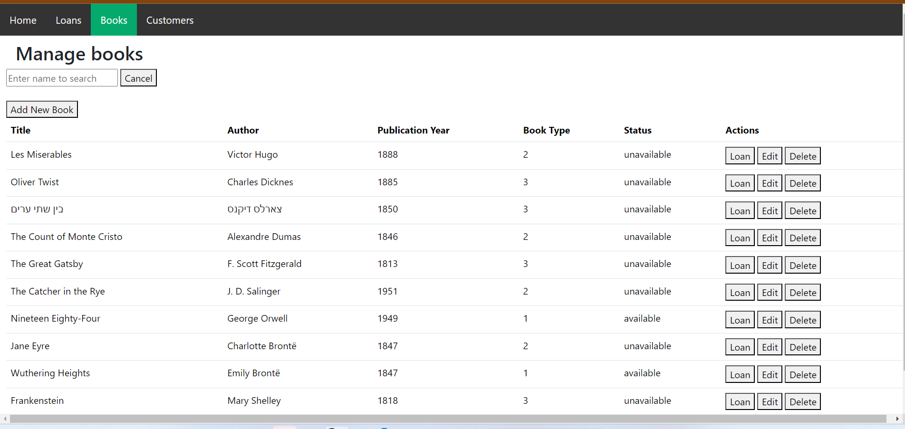
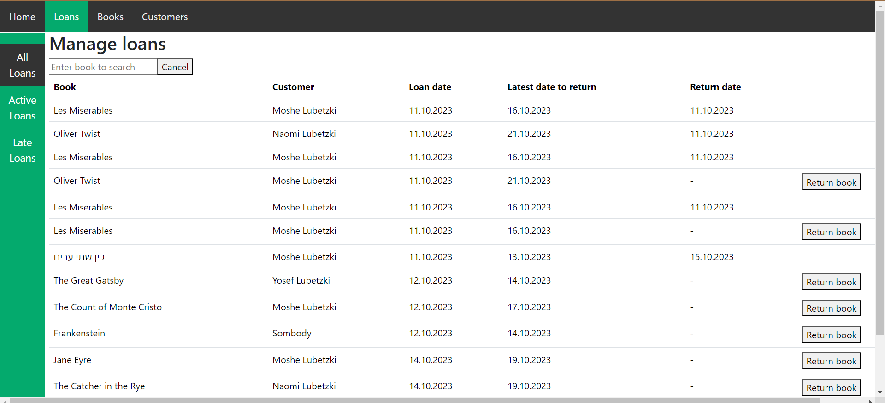

# Library Management System

The Library Management System is a web-based application built using Flask and SQLAlchemy for managing books, customers, and loans in a library. This README provides an overview of the project, its features, and instructions for setting up and running the application.

## Table of Contents

- [Features](#features)
- [Prerequisites](#prerequisites)
- [Setup](#setup)
- [Usage](#usage)
- [API Endpoints](#api-endpoints)
- [Contributing](#contributing)
- [Contact](#contact)

## Features

- **Books Management:** Easily add, edit, or remove books from the library's collection.
- **Customers Management:** Add, delete, and update customer information.
- **Loans Management:** Create, view, and end loans, and check for late loans.
- **Responsive Web Interface:** Access the application through a web browser with a user-friendly interface.

## Prerequisites

Before you start, ensure you have met the following requirements:

- Python (version 3.7 or higher)
- Flask
- SQLAlchemy
- SQLite (for the database)

## Setup

1. Clone the repository:

   ```bash
   git clone https://github.com/MosheL2680/Library.git

2. Install the required dependencies:

    ```bash
    pip install -r requirements.txt

## Usage

1. Run the Flask application:

    ```bash
    py app.py

2. Access the application in your web browser at http://localhost:5001/. (You can also simply enter the link flask will give u in the bash)

3. You can now use the Library Management System to manage books, customers, and loans.

## API Endpoints

The project provides the following API endpoints:

### Books:

- `POST /books`: Create a new book.
- `GET /books`: Retrieve all books.
- `PUT /books/<bookID>`: Update a book.
- `DELETE /books/<bookID>`: Delete a book.

### Customers:

- `POST /customers`: Create a new customer.
- `GET /customers`: Retrieve all customers.
- `PUT /customers/<customerID>`: Update a customer.
- `DELETE /customers/<customerID>`: Delete a customer.

### Loans:

- `POST /loans`: Create a new loan.
- `GET /loans`: Retrieve all loans.
- `PUT /loans/<loan_id>`: End a loan.
- `GET /loans/late`: Retrieve late loans.

## Contributing

If you'd like to contribute to this project, please fork the repository and create a pull request with your changes. We welcome contributions and improvements.

## Contact

If you have any questions or need assistance, please contact me at:

- Email: moshelubetski@gmail.com
- Phone: 0544-22-0002


## Web Appearance

The project provides a web-based interface for managing your library's collection of books, loans, and customers. The user interface is built using HTML, CSS, and JavaScript, and it is served via a Flask web application.

### Screenshots

Here are screenshots of the different pages in the web application:

#### Home Page


#### Books Page


#### Customers Page


#### Loans Page



